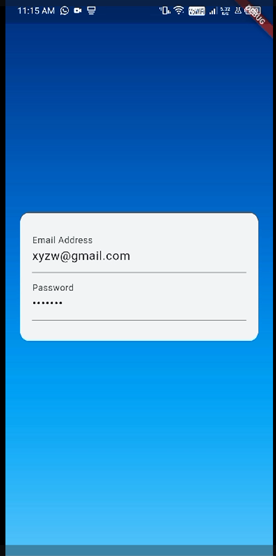
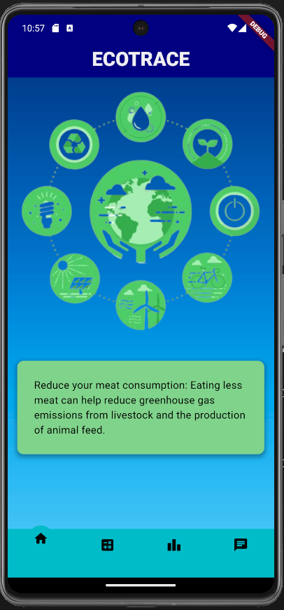
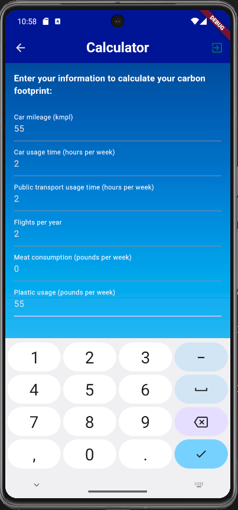
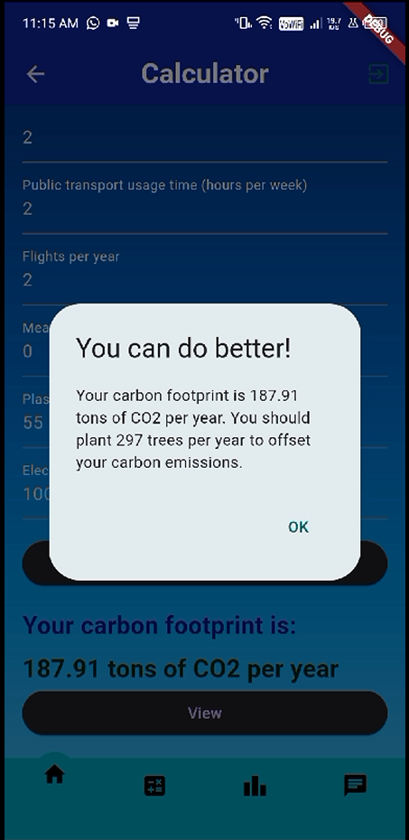
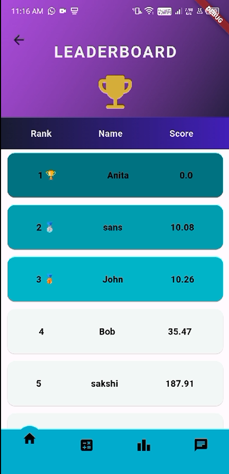
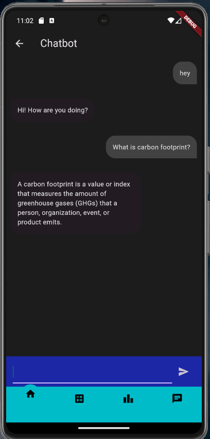
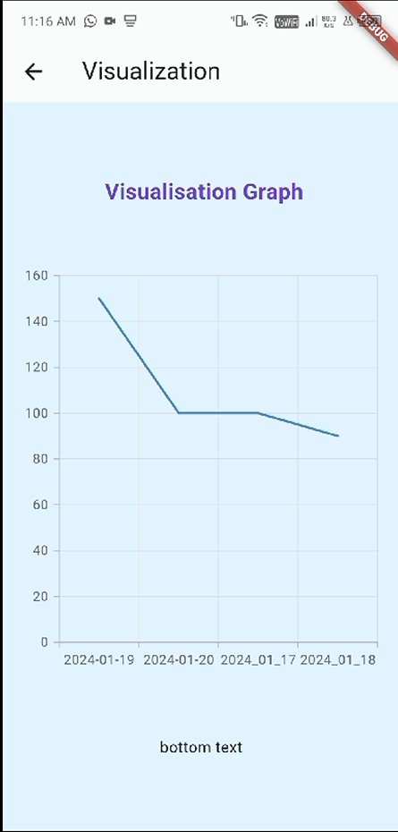
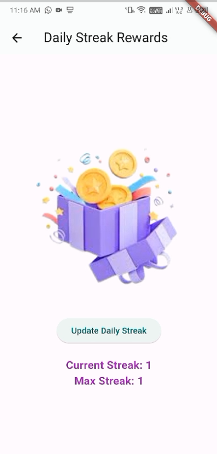

# Carbon Footprint Tracker

## Table of Contents

1. [Description](#description)
2. [Features](#features)
3. [Getting Started](#getting-started)
   - [Prerequisites](#prerequisites)
   - [Installation](#installation)
   - [Running the App](#running-the-app)
4. [Usage](#usage)

## Description

The Carbon Footprint Tracker is a Flutter application designed to help users monitor and reduce their carbon footprint. The app provides various features to calculate, visualize, and engage users in eco-friendly practices.

## Features

- **Signup**: Create a new account to start using the app.
- 

- **Login**: Access your account with your credentials.
- 

- **Splash Screen**: The initial screen that appears when the app launches.
- 

- **Home Screen**: The main screen where users can navigate to different features.
- 

- **Footprint Calculator**: Calculate your carbon footprint with tips and suggestions.
- 
- 

- **Leaderboard**: View the scores of all users, with the top 3 highlighted based on their low carbon footprint.
- 

- **Chatbot**: Interact with the chatbot powered by Dialogflow to get personalized tips and information.
- 

- **Graph View**: Visualize your carbon footprint over the week.
- 

- **View Rewards**: Check your current and maximum streak for eco-friendly practices.
- 


## Getting Started

For help getting started with Flutter development, view the [online documentation](https://docs.flutter.dev/), which offers tutorials, samples, guidance on mobile development, and a full API reference.

### Prerequisites

- Ensure you have Flutter installed. For installation instructions, visit [Flutter Installation Guide](https://flutter.dev/docs/get-started/install).
- Set up Firebase.

### Installation

Clone the repository to your local machine:

```bash
git clone <repository-url>
cd <repository-directory>
```

### Running the App
- Connect a device or start an emulator.
- Run the app: `flutter run`

## Usage

Follow these instructions to use the application:

1. Open the app.
2. Use the Footprint Calculator to estimate your carbon footprint.
3. Check the Leaderboard to see how you compare with other users.
4. View your weekly data in the Graph View.
5. Track your rewards and streaks in the Rewards section.
6. Interact with the Chatbot for personalized tips.


---
